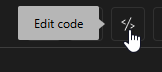

# Koi - Backend

This is a guide on how to setup the Koi Cloudflare Worker

## Requirements
- A Cloudflare account

## Setup
### Create a KV namespace
- Create a KV namespace [here](https://dash.cloudflare.com/?to=/:account/workers/kv/namespaces) and give it a unique name
### Create a worker
- Go to your account > Workers & Pages > Overview ↗.
- Select Create.
- Select Create Worker.
- Give your Worker a unique name 
- Select Deploy.
### Bind the KV namespace to the Worker
- Go to Workers & Pages > Overview ↗.
- Select the worker you just created.
- Select Settings.
- Scroll to Bindings, then select Add.
- Select KV namespace.
- Name your binding **DATA_KV** in Variable name, then select the KV namespace  you created from the dropdown menu.
- Select Deploy to deploy your binding.
### Adding the code
- Click this button

- Delete everything in the code editor, and paste the code from worker.js into it
- **IMPORTANT!** Ensure you edit the AUTH_TOKEN to match your "KoiToken" value in config.json!

alright im bored ill finish this later